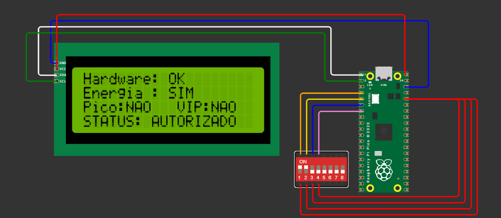

<div align="center">

  <h1>Smart Charge EV</h1>
  <h3>Gestão Inteligente para Infraestrutura de Veículos Elétricos</h3>
  <p><b>Sprint 04</b> | Lógica Digital e IoT (1º Ano)</p>

  <!-- Badges de Tecnologia -->
  
  
  
  
  <br><br>

  
  <p><i>Interface do sistema exibindo a autorização de carga após a validação das variáveis em tempo real.</i></p>

  <h2><a href="https://wokwi.com/projects/476507381254916097">🔗 Acesse a Simulação Interativa no Wokwi</a></h2>
</div>

<br>
<hr>

## Índice
- [Sobre o Projeto](#-sobre-o-projeto)
- [Arquitetura Lógica](#-arquitetura-lógica-e-otimização-matemática)
- [Stack Tecnológico](#️️-stack-tecnológico-e-hardware)
- [Estrutura do Repositório](#-estrutura-do-repositório)
- [Casos de Teste](#-validação-e-casos-de-teste)
- [Guia de Execução](#-guia-de-execução-local)
- [Equipe](#-equipe-de-desenvolvimento)

---

## Sobre o Projeto
Este repositório apresenta o **Smart Charge EV**, um protótipo de IoT concebido para simular um totem descentralizado de carregamento de veículos elétricos comerciais. O sistema utiliza um microcontrolador **Raspberry Pi Pico** para processar regras de negócio e condições de hardware em tempo real, garantindo a segurança do usuário e a estabilidade da rede elétrica através da gestão inteligente em horários de pico.

---

## Arquitetura Lógica e Otimização Matemática
O núcleo de tomada de decisão do sistema foi rigorosamente otimizado através da **Álgebra Booleana**. As 9 variáveis originais de ambiente e hardware foram condensadas em 4 macrovariáveis de estado:

* **`K` (Hardware):** Integridade física (Veículo conectado, bateria não cheia, autenticação válida).
* **`F` (Energia):** Disponibilidade de fonte energética (Rede estabilizada, Matriz Solar, etc.).
* **`H` (Pico):** Indicador de horário de maior esforço na rede elétrica local.
* **`P` (Prioridade):** Credencial VIP ou prioritária (ex: frotas de logística essenciais ou emergências).

A expressão original (Soma de Produtos) foi simplificada para reduzir a latência de processamento e a necessidade de portas lógicas físicas. O microcontrolador processa continuamente a seguinte equação otimizada:

<div align="center">
  <h3><code>S = K · F · (~H + P)</code></h3>
</div>

---

## Stack Tecnológico e Hardware
O protótipo virtual foi implementado e validado utilizando a seguinte arquitetura:

- **Microcontrolador:** Raspberry Pi Pico (Programado em MicroPython)
- **Interface Homem-Máquina (IHM):** Display LCD 20x4 operando via protocolo I2C
- **Telemetria Simulada:** DIP Switch de 4 vias (sensores de entrada para pinos lógicos)

---

## Estrutura do Repositório
```text
📦 smart-charge-ev
 ┣ 📜 main.py                  # Lógica embarcada e mini-driver I2C em MicroPython
 ┣ 📜 simulacao_wokwi_lcd.png  # Evidência visual do protótipo validado
 ┗ 📜 README.md                # Documentação técnica do projeto
```

---

## Validação e Casos de Teste
O sistema foi submetido a uma bateria de testes rigorosos para garantir o cumprimento estrito das normas de segurança física e das regras de tarifação energética.

<div align="center">

| Cenário de Teste | `K` (Hardware) | `F` (Energia) | `H` (Pico) | `P` (VIP) | Resultado Esperado | Status |
| :--- | :---: | :---: | :---: | :---: | :--- | :---: |
| **01. Condições Ideais** | 1 | 1 | 0 | 0 | ✅ Autorizado | ✔️ Passou |
| **02. Restrição de Rede** | 1 | 1 | 1 | 0 | ❌ Impedido *(Sobrecarga)* | ✔️ Passou |
| **03. Exceção Prioritária** | 1 | 1 | 1 | 1 | ✅ Autorizado *(Override VIP)* | ✔️ Passou |
| **04. Falha de Alimentação** | 1 | 0 | 0 | 0 | ❌ Impedido *(Sem Fonte)* | ✔️ Passou |
| **05. Bloqueio de Segurança**| 0 | 1 | 0 | 1 | ❌ Impedido *(Risco Físico)* | ✔️ Passou |

</div>

---

## Guia de Execução Local
Para replicar este ambiente de validação:

1. Acesse o simulador [Wokwi](https://wokwi.com/).
2. Inicie um novo projeto do tipo **MicroPython on Pi Pico**.
3. Adicione um módulo **LCD 20x4 (I2C)** e conecte o `SDA` no pino `GP0` e o `SCL` no pino `GP1`.
4. Adicione um **DIP Switch de 8 vias** e conecte as saídas 1 a 4 aos pinos `GP2`, `GP3`, `GP4` e `GP5`. Alimente o lado oposto com a saída `3V3` do Pico.
5. Copie e cole o código do arquivo `main.py` presente neste repositório.
6. Dê *Play* na simulação e interaja com os interruptores.

---

## Equipe de Desenvolvimento
<details>
  <summary><b>Clique para expandir a lista de integrantes</b></summary>
  <br>
  <ul>
    <li><b>Leonardo Scotti Tobias</b> (RM: 573305)</li>
    <li><b>Natan Silva da Costa</b> (RM: 573100)</li>
    <li><b>Enzo Seiji Delgado Tabuchi</b> (RM: 573156)</li>
    <li><b>Luca Almeida Lucareli</b> (RM: 569061)</li>
    <li><b>Henrique Almeida Lucareli</b> (RM: 569183)</li>
  </ul>
</details>
